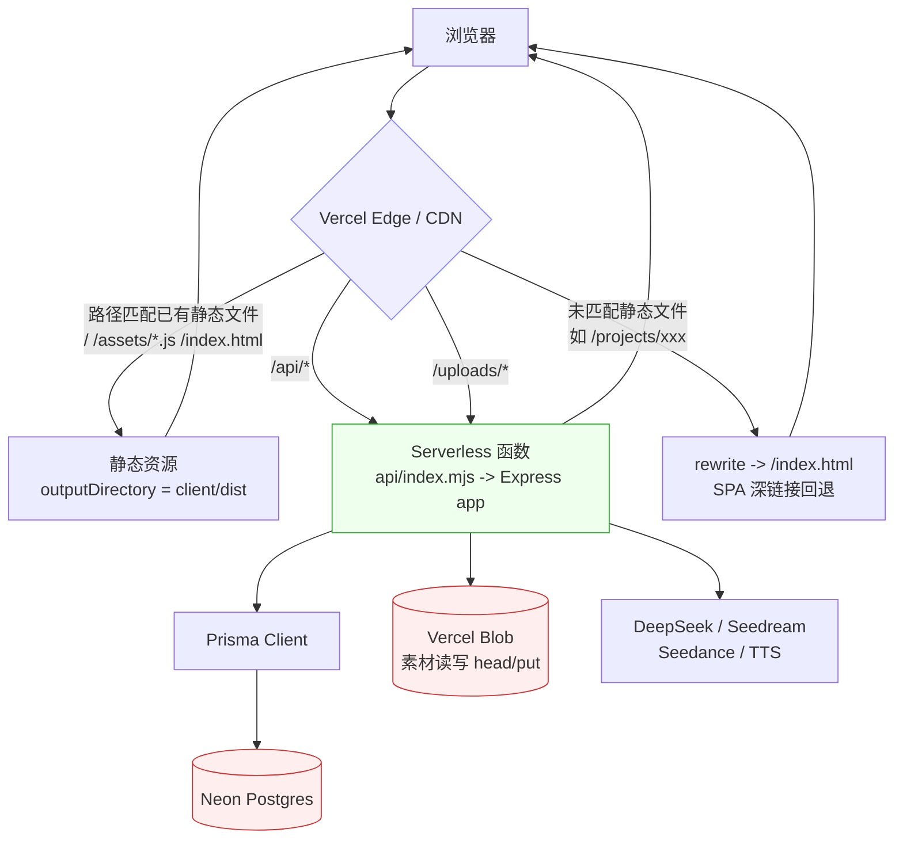
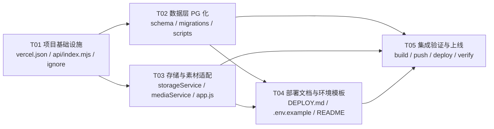

# 幕间 · AI 短剧工作台 — Vercel 全栈部署架构设计

> 版本：v1.0 ｜ 角色：架构师（高见远） ｜ 目标：把现有 React(Vite) + Express + Prisma 全栈项目，通过 GitHub 部署成一个**公网可访问**的 Vercel 站点。
> 本文档只描述**设计与任务分解**，不含业务代码实现。

---

## 0. 执行摘要与关键更正

### 0.1 一句话方案
**一个 Vercel 项目 = 「静态前端（client/dist，走 CDN）」+「单个 Serverless 函数（api/index.mjs，承载整个 Express API）」+「Neon Postgres（数据库）」+「Vercel Blob（素材存储）」**。前端由 Vercel 静态托管，`/api/*` 与 `/uploads/*` 通过 `rewrites` 打到同一个函数，函数内部交给现有 Express `app` 处理。

### 0.2 三个必须先纠正的假设（影响实现正确性）

| # | 原侦察结论 | 复核结果（附官方依据） | 影响 |
|---|-----------|----------------------|------|
| 1 | Hobby 版单函数**最长 60 秒** | **不成立**。Vercel 现行文档：Hobby 计划在 **Fluid compute**（新项目默认开启）下 `maxDuration` **默认上限 300 秒**（Pro 800s / 扩展 1800s）。Vercel Functions Limits 页："Hobby: 300s default and maximum." | `vercel.json` 里可放心写 `maxDuration: 300`，超时风险大幅下降，异步化改造降级为「防御性优化」 |
| 2 | `api/index.mjs` 依赖 `x-vercel-forwarded-path` 请求头还原路径 | **该请求头不是 Vercel 文档化行为**。正确事实是：**rewrite 会把「原始请求的 path/headers/cookies 原样传递」给 Serverless 函数**（Vercel 官方："the original request's path, headers, and cookies will be preserved and passed on to your existing server solution"）。因此函数里 `req.url` 本就是原始路径，**直接 `app(req,res)` 即可，无需读任何头** | 删除 `api/index.mjs` 里的头解析逻辑，降低出错面 |
| 3 | `express.static` 在 Vercel 上为前端服务 | **不成立**。官方明示："Express's own `express.static()` helper is **ignored** on Vercel"，静态资源必须放在 `outputDirectory`/`public` 由 CDN 托管 | 前端静态文件交给 `outputDirectory: client/dist`，SPA 深链接交给 `rewrites` 回退到 `index.html`；`server/app.js` 里的静态块需加守卫（仅本地生效） |

---

# Part A · 系统设计

## 1. 实现方案总览（请求流转）

### 1.1 组件与职责

- **Vercel CDN / Edge**：处理路由优先级（Redirects → … → 文件系统静态 → Rewrites），直接托管 `client/dist` 静态文件。
- **Vercel Function `api/index.mjs`**：唯一的后端函数（Node.js runtime）。导出 `handler(req,res)`，内部调用 `server/app.js` 导出的 Express `app`。承载全部 `/api/*` 与 `/uploads/*` 请求。
- **Express app（`server/app.js`）**：纯 API 层（`/api/projects/*`、`/api/*` 媒体路由、`/api/health`、`/uploads/*` 302 重定向、统一错误处理）。
- **Neon Postgres**：由 Vercel Marketplace 提供，Prisma 连接。
- **Vercel Blob**：素材对象存储（图片/视频/音频），`@vercel/blob` 读写。
- **外部 AI 服务**：DeepSeek（文本）、火山引擎 Seedream（图）、Seedance（视频）、豆包 TTS（语音）。

### 1.2 请求流转图



### 1.3 各路径由谁处理（对照表）

| 请求路径 | 处理者 | 说明 |
|---------|--------|------|
| `/`、`/assets/*`、`/index.html`、字体等 | **Vercel 静态托管** | 构建产物 `client/dist`，走 CDN，不经过函数 |
| `/projects/:id`、`/script/:id` 等 SPA 深链接（硬刷新） | **Vercel rewrite → `/index.html`** | `react-router` 为 `BrowserRouter`，必须回退，否则 404 |
| `/api/projects/*`、`/api/*` | **Serverless 函数 → Express** | rewrite `/api/(.*)` → `/api/index`，函数内 `req.url` 保持原始路径 |
| `/uploads/<相对路径>` | **Serverless 函数 → 302 重定向到 Blob 公网 URL** | 前端 `/<video>` 语义不变，浏览器自动跟随 302 |
| 给 Seedance 的「首帧/参考图」URL | **Blob 公网 URL（直链）** | 后端不再走 `/uploads` 中转，避免依赖「第三方是否跟随 302」 |

---

## 2. 必须解决的问题清单（逐条 + 明确解法）

### 问题 1：Prisma 迁移的 PostgreSQL 化（致命阻塞）
**现状**：`server/prisma/schema.prisma` 已改为 `postgresql`，但 `server/prisma/migrations/20260930170202_init/migration.sql` 是 **SQLite 方言**（`TEXT` 主键、`DATETIME ... DEFAULT CURRENT_TIMESTAMP`、`INTEGER`），且 `migration_lock.toml` 写着 `provider = "sqlite"`。`prisma migrate deploy` 会因 provider 不匹配直接失败。

**两条路线评估**

| 路线 | 做法 | 优点 | 缺点 |
|------|------|------|------|
| **A. 重建 Postgres 迁移（推荐）** | ① 删除 SQLite 迁移目录；② 把 `migration_lock.toml` 改为 `provider = "postgresql"`；③ 离线用 `prisma migrate diff --from-empty --to-schema-datamodel server/prisma/schema.prisma --script` 生成 Postgres DDL，写入新迁移目录；④ `prisma migrate deploy` 在 Vercel 构建期应用 | 迁移历史可追溯、幂等（只应用未执行的迁移）、生产级做法、后续改 schema 有据可依 | 需要一次性离线生成 DDL（本机可做，`migrate diff` 无需连库） |
| **B. 改用 `prisma db push`** | 构建命令改成 `prisma db push --schema server/prisma/schema.prisma --skip-generate` | 最省事，无需迁移文件 | 无迁移历史；对空库尚可，但后续 schema 变更可能触发数据风险，不适合长期 |

**推荐：路线 A**。理由：Neon 云端是**全新空库**，一次性生成初始 Postgres 迁移成本极低；而 `migrate deploy` 幂等、可重复执行，是唯一能在「每次构建都跑」的场景下安全运行的方案（构建命令里天然会重复执行）。`db push` 反复在构建期扫库不理想。

**关键命令（离线，不连库）**：
```bash
# 在项目根目录执行（Windows Git Bash）
mkdir -p server/prisma/migrations/20260101000000_init_postgres
npx prisma migrate diff \
  --from-empty \
  --to-schema-datamodel server/prisma/schema.prisma \
  --script \
  > server/prisma/migrations/20260101000000_init_postgres/migration.sql
# 然后把 migration_lock.toml 改为 provider = "postgresql"
```

> 注意：`migrate diff --from-empty --to-schema-datamodel` 是**纯离线**运算，不需要 `DATABASE_URL` 能连通，因此可先在本机生成、随代码提交。

### 问题 2：Vercel rewrite + Express 的 URL 还原方式是否可靠
**结论**：现行 `x-vercel-forwarded-path` 头假设**不成立**（无此文档化头）。但**不需要**它——Vercel rewrite 会保留原始请求 path 交给函数。官方正例即 `{ "source": "/api/(.*)", "destination": "/api/index" }` 配 Express 路由 `/api/health` 正常工作，证明 `req.url` 到达函数时仍是原始路径。

**可靠写法**：
```js
// api/index.mjs —— 直接透传，无需任何头处理
import { app } from '../server/app.js';
export default function handler(request, response) {
  return app(request, response);
}
```
> 备选（更极简、官方 zero-config 风格）：把 Express app 作为默认导出（`export default app`），并把 rewrite 写成 `{ "source": "/(.*)", "destination": "/api" }`。**但不采用**，因为该通配会把静态资源也打进函数、丧失 CDN，且与本项目的 `/api` 前缀路由冲突。本项目采用**精确 rewrite**（见问题 3 / 文件 `vercel.json`）。

### 问题 3：SPA 深链接在 Vercel 静态托管下的回退
**现状**：`client/src/main.jsx` 使用 `BrowserRouter`；路由如 `/project/:projectId`、`/script/:projectId`。硬刷新这些地址时，Vercel 找不到静态文件会 404。

**解法**：在 `vercel.json` 增加**排除 api/uploads/assets 的兜底 rewrite** 回退到 `/index.html`：
```json
{ "source": "/((?!api/|uploads/|assets/).*)", "destination": "/index.html" }
```
- `/api/(.*)`、`/uploads/(.*)` 被更靠前/更具体的规则命中，进函数；
- `/assets/xxx.js` 命中真实静态文件，不进回退；
- 其余未知路径（含 `/project/123`）回退到 `index.html`，交给前端路由。
> 该写法在「rewrite 先于文件系统」或「文件系统先于 rewrite」两种求值顺序下都安全（真实存在的静态文件始终优先命中）。

### 问题 4：Prisma Client 在 Serverless 函数中的生成与打包
**要点与解法**：
1. **构建期生成**：`buildCommand` 中必须包含 `npm run db:generate`（= `prisma generate --schema server/prisma/schema.prisma`），确保 `node_modules/.prisma/client` 存在。
2. **binaryTargets**：Vercel 构建机与运行机均为 Linux x64，Prisma 6 的 query engine 需要匹配的 `.so.node`。为稳妥，在 generator 显式声明：
   ```prisma
   generator client {
     provider      = "prisma-client-js"
     binaryTargets = ["native", "rhel-openssl-3.0.x"]
   }
   ```
   （构建在 Linux 上执行时 `native` 即 Linux，`rhel-openssl-3.0.x` 是 Vercel/Amazon Linux 2023 的兜底，避免镜像 OpenSSL 版本差异导致 `Unable to find query engine`。）
3. **打包追踪**：`api/index.mjs` → `../server/app.js` → `@prisma/client`，npm workspaces 会把 `@prisma/client` 提升到根 `node_modules`，Vercel 的 node-file-trace 会正确追踪。**无需**自定义 `outputFileTracingIncludes`。
4. **不使用自定义 output 路径**（保持默认 `node_modules/.prisma/client`），避免追踪遗漏。
5. **连接池**：Neon 连接串默认走 pgbouncer。datasource 增加 `directUrl` 用于迁移（见问题 7）。

### 问题 5：`maxDuration` 与长文本生成的超时规避
**平台事实**：Hobby + Fluid compute（新项目默认）= `maxDuration` 上限 **300 秒**。本项目最重的接口是 DeepSeek 长文本生成（`story/characters/script/storyboard/image-prompts`），`server/providers/deepseek.js` 里单次 `httpTimeoutMs=120s`、`retryCount=3` → **理论最坏 360s**，极端情况下仍可能顶破 300s。

**解法（分层）**：
1. **配置层（必做）**：`vercel.json` 设 `functions["api/index.mjs"].maxDuration = 300`。
2. **防御层（P1，推荐）**：把 `completeJSON` 的重试从 3 次降为 2 次，或总预算封顶（例如按 `AbortController` 设 240s 总超时），避免「3×120s」叠加超限。
3. **交互层（P1，推荐）**：前端对长任务显示「生成中…」并捕获 504（`FUNCTION_INVOCATION_TIMEOUT`），提示用户改用**分集生成**（`POST /:id/script` 传 `episodeNumber`，已有能力，单集生成显著短）。
4. **无需**改造为后台异步任务：现有架构本就是「前端逐个调用 run / 轮询 video status」，没有长驻进程，天然适配 Serverless。

### 问题 6：`/uploads/*` 重定向链路与 `PUBLIC_BASE_URL` 的取舍
**现状链路**：`publicAssetUrl()`（**同步**）返回 `PUBLIC_BASE_URL + /uploads/<path>`，被 `mediaService` 多处**同步调用**，用于给 **Seedance 参考图** 构造外网可访问 URL；`server/app.js` 的 `/uploads/*` 再用 `blobUrlFor()`（**异步 `head()`**）302 到 Blob。

**风险**：Seedance（火山引擎）在境外抓取 `你的域名/uploads/...` 是否**跟随 302** 无保证；且多一跳、依赖 `PUBLIC_BASE_URL` 必须正确填写。

**解法（推荐）**：
- **后端 → 第三方（Seedance）一律直连 Blob 公网 URL**：把 `publicAssetUrl` 改为**异步**，直接返回 `blobUrlFor(filePath)`。素材 `put` 时已用 `access:'public'`，Blob 直链可被外部访问。
- **同步改异步的成本**：`publicAssetUrl` 在 `mediaService.js` 共 **6 处**同步调用，且**全部位于 async 函数体内**，改成 `await publicAssetUrl(...)` 即可，无架构性阻碍：
  - `generateCharacterImage` 1 处（第 34 行）
  - `generateShotImage` 3 处（第 77–79 行，含 for 循环）
  - `createShotVideo` 2 处（第 107–108 行）
- **`/uploads/*` 302 链路保留**：仅服务于**前端展示**（`/<video>`，浏览器天然跟随 302），语义不变，无需改前端。
- **`PUBLIC_BASE_URL` 退役**：改用 Blob 直链后不再需要它；`requireConfig('PUBLIC_BASE_URL')` 与 `PUBLIC_BASE_URL_MISSING` 分支可移除（保留亦无害）。

### 问题 7：数据库连接串（Neon 池化 vs 直连）
Neon 提供的 `DATABASE_URL` 是**池化**（pgbouncer）连接，适合 Serverless 运行时；但 `prisma migrate deploy` 走池化可能报 prepared statement 相关错误。**解法**：datasource 增加 `directUrl` 指向非池化连接：
```prisma
datasource db {
  provider  = "postgresql"
  url       = env("DATABASE_URL")
  directUrl = env("DATABASE_URL_UNPOOLED")   // Neon 集成自动注入
}
```
> 若使用自有 Postgres，则把环境变量 `DATABASE_URL_UNPOOLED` 指向同一库的直连串即可。

### 问题 8：`.mjs` 与模块系统
根 `package.json` **无** `"type":"module"`；`client`、`server` 各自有 `"type":"module"`。
- `api/index.mjs` 用 `.mjs` 扩展名 → **始终按 ESM 解析**（不受根 `type` 影响），`import` 语法可用。✅ 结论：`.mjs` 可行且必要。
- `api/index.mjs` 里 `import { app } from '../server/app.js'` → 因 `server/package.json` 有 `"type":"module"`，`server/app.js` 按 ESM 解析，导出/导入一致。✅
- 若把入口改名为 `api/index.js`，会被当作 **CommonJS**，`import` 会报错。**故保持 `.mjs`**。

---

## 3. 文件列表（相对路径，含 新增/修改/删除）

```text
仓库根
├── vercel.json                                   [修改] 修正 rewrites + maxDuration=300
├── api/
│   └── index.mjs                                 [修改] 去掉 x-vercel-forwarded-path，直接 app(req,res)
├── package.json                                  [修改] db:migrate:deploy 改为 workspace 化执行（更稳）
├── .gitignore                                    [修改] 追加 .vercel/
├── .vercelignore                                 [新增] 排除 uploads/dev.db/docs 等，瘦身上传体积
├── README.md                                     [修改] 增补"部署到 Vercel"章节与链接
│
├── docs/
│   ├── deploy-architecture.md                    [新增] 本文档
│   ├── sequence-diagram.mermaid                  [新增] 调用流程时序图
│   ├── class-diagram.mermaid                     [新增] 类与接口图
│   └── DEPLOY.md                                 [新增] 面向操作者的逐步 Runbook
│
├── client/                                       [无需改动]（Vite 构建产物 client/dist 由 Vercel 托管）
│   ├── vite.config.js                            [不改] 仅 dev 代理，生产无关
│   └── src/main.jsx (BrowserRouter)              [不改] 依赖 SPA 回退 rewrite
│
└── server/
    ├── index.js                                  [修改·可选] 保持瘦身本地入口（如已瘦身可不动）
    ├── app.js                                    [修改] 静态服务块加 `if(!process.env.VERCEL)` 守卫；移除 PUBLIC_BASE_URL 相关分支（可选）
    ├── package.json                              [修改] 新增 prisma:deploy 脚本
    ├── .env.example                              [修改] DATABASE_URL 改为 Postgres 示例；补 DATABASE_URL_UNPOOLED；补充 Blob 说明
    ├── services/
    │   ├── storageService.js                     [修改] publicAssetUrl 改异步返回 Blob 直链
    │   └── mediaService.js                       [修改] 6 处 publicAssetUrl 调用加 await
    └── prisma/
        ├── schema.prisma                         [修改] generator 加 binaryTargets；datasource 加 directUrl
        ├── migrations/
        │   ├── migration_lock.toml               [修改] provider = "postgresql"
        │   ├── 20260930170202_init/              [删除] SQLite 方言迁移目录
        │   └── 20260101000000_init_postgres/
        │       └── migration.sql                 [新增] PostgreSQL 初始迁移（离线生成）
        └── dev.db                                [删除·本地] 本地 SQLite 残留，可不提交/删掉
```

> 说明：`api/` 与 `client/` 属于不同构建单元；`client` 侧**无需任何代码改动**，前端调用仍是相对路径 `/api/...` 与 `/uploads/...`。

---

## 4. 数据结构与接口

### 4.1 类图（另存 `docs/class-diagram.mermaid`）

见 §4.3。下表给出**关键对外接口签名**。

### 4.2 关键函数签名（改动重点：`storageService`）

```ts
// server/services/storageService.js  —— mediaService.js 与 app.js 共同依赖
saveBuffer(kind: string, projectId: string, buffer: Buffer,
           contentType: string, fallbackExtension?: string)
  : Promise<{ filePath: string; url: string; size: number }>
//   filePath 形如 "images/<projectId>/<ts>-<uuid>.jpg"；Blob pathname = `media/${filePath}`

saveRemote(kind: string, projectId: string, url: string, fallbackExtension?: string)
  : Promise<{ filePath: string; url: string; size: number }>

// ★ 变更：由同步改为异步，直接返回 Blob 公网地址（替代 PUBLIC_BASE_URL + /uploads 链路）
publicAssetUrl(filePath: string): Promise<string>
//   实现语义：return blobUrlFor(filePath)

blobUrlFor(filePath: string): Promise<string>       // head(`media/${filePath}`) -> blob.url

parseJson(value: unknown, fallback: T): T           // 未变
```

```ts
// server/services/mediaService.js  —— 受影响调用点（全部在 async 函数内，改 await 即可）
generateCharacterImage(characterId): Promise<Asset>   // 第34行  references = [await publicAssetUrl(...)]
generateShotImage(shotId): Promise<Asset>             // 第77~79行 references.push(await publicAssetUrl(...)) ×3
createShotVideo(shotId): Promise<{taskId,status}>     // 第107~108行 imageUrl/lastFrameUrl = await publicAssetUrl(...)
startAssetQueue(projectId, types): Promise<{queued,tasks,limits}>
runAssetTask(taskId): Promise<AiTask>
getShotVideoStatus(shotId): Promise<{status,progress,videoUrl?,lastFrameUrl?,error?}>
```

```js
// api/index.mjs  —— Vercel 函数入口（唯一后端入口）
export default function handler(request, response): void   // 内部 return app(request, response)
```

```js
// server/app.js
export const app: Express                    // 整个 API 应用
export { prisma }                            // 供本地 index.js 复用
// 路由挂载：/uploads/* (302->Blob) | /api/health | /api/projects/* | /api/*(media) | /api 404 | 错误处理
```

### 4.3 类图（Mermaid）

见同目录 `docs/class-diagram.mermaid`。

---

## 5. 程序调用流程

### 5.1 时序图（Mermaid，另存 `docs/sequence-diagram.mermaid`）

覆盖三类关键流程：① 页面加载 + SPA 深链接；② 文本生成（DeepSeek）；③ 素材生成（Seedream 图 / Seedance 视频 / TTS）与 Blob 写入。

---

## 6. 待明确事项 / 风险清单

| # | 风险 | 说明 | 建议 |
|---|------|------|------|
| R1 | **Hobby 商用限制** | Vercel Hobby 计划面向个人/非商业用途；用作对外商用产品可能违反条款 | 若为商用，升 Pro；否则保持个人使用 |
| R2 | **AI 模型 ID 缺失** | `server/.env` 中 `SEEDREAM_MODEL` / `SEEDANCE_MODEL` / `TTS_RESOURCE_ID` **为空**，运行时 `requireConfig` 会抛 `CONFIG_MISSING`，**图像/视频/配音接口不可用**（文本生成可用） | 部署前必须补齐这三个模型 ID 到 Vercel 环境变量 |
| R3 | **DeepSeek 模型名** | `DEEPSEEK_MODEL=deepseek-flash` 是否为有效模型名待确认 | 核实后填入正确模型（如 `deepseek-chat`） |
| R4 | **跨境抓取** | Seedance（国内）需抓取 Vercel Blob（境外）公网图，可能有时延/偶发失败 | 首帧图尽量压缩；失败可重试（已有重试机制） |
| R5 | **免费额度** | Neon 免费层存储/算力有限；Vercel Blob 免费层有存储与操作数上限；函数有调用/时长配额 | 关注用量；素材体积大时注意 Blob 额度 |
| R6 | **本地 dev.db** | `server/prisma/dev.db` 为 SQLite 残留，已 gitignore | 可安全删除；云端用 Neon，不再需要 |
| R7 | **构建期 CLI 可用性** | `prisma` 是 `server` 的 devDependency，Vercel 构建默认安装 devDependencies；若出现 `prisma: not found` | 兜底：把 `prisma` 移入 `server` 的 `dependencies` |
| R8 | **迁移目录必须清干净** | 旧 SQLite 迁移若残留，`migrate deploy` 必失败 | 删除旧目录 + `migration_lock.toml` 改 postgresql（见问题 1） |
| R9 | **无访问限制** | 用户已确认公开可用，API 额度可能被刷 | 接受风险；如需缓解可后续加简单口令中间件（本期不做） |
| R10 | **冷启动** | Prisma engine 冷启动约 1~2s | 可接受；必要时用 Fluid 常驻/预热 |
| R11 | **环境变量改动需重新部署** | Vercel 环境变量在构建/运行时注入，改动后需 Redeploy 生效 | Runbook 中明确 |

---

# Part B · 任务分解

## 7. 依赖包清单

现有已满足，**无需新增业务依赖**。部署相关：

```
- @vercel/blob@^1.0.0            # 已在 server/package.json（素材存储）
- @prisma/client@^6.19.0         # 已有（运行时）
- prisma@^6.19.0                 # 已有（server devDependency，构建期 migrate/generate）
- express@^4.21.2                # 已有
- dotenv@^16.6.1                 # 已有（本地读 server/.env；Vercel 上由平台注入）
```
平台托管服务（Vercel Marketplace 配置，非 npm 依赖）：**Neon Postgres**、**Vercel Blob**。

---

## 8. 任务列表（按依赖排序）

> 硬性约束：**≤5 个任务**；每任务 **≥3 个文件**；T01 为基础设施；尽量扁平依赖。

### T01 — 项目基础设施（Vercel 配置层）｜P0｜无依赖
**Source Files**
- `vercel.json`（修改）：修正 `rewrites`（`/api/(.*)`、`/uploads/(.*)` → `/api/index`；SPA 兜底 `/((?!api/|uploads/|assets/).*)` → `/index.html`）；`functions["api/index.mjs"].maxDuration = 300`；保留 `buildCommand`/`outputDirectory`
- `api/index.mjs`（修改）：删除 `x-vercel-forwarded-path` 逻辑，改为 `export default function handler(req,res){ return app(req,res) }`
- `.gitignore`（修改）：追加 `.vercel/`
- `.vercelignore`（新增）：排除 `server/uploads/**`、`server/prisma/*.db`、`client/dist`、`docs`、`*.log`

**验收**：`rewrites` 三段齐全；函数入口无自定义头；`maxDuration=300`。

### T02 — 数据层 PostgreSQL 化｜P0｜依赖 T01
**Source Files**
- `server/prisma/schema.prisma`（修改）：`generator client` 加 `binaryTargets = ["native","rhel-openssl-3.0.x"]`；`datasource db` 加 `directUrl = env("DATABASE_URL_UNPOOLED")`
- `server/prisma/migrations/migration_lock.toml`（修改）：`provider = "postgresql"`
- `server/prisma/migrations/20260930170202_init/`（删除）：移除 SQLite 方言迁移
- `server/prisma/migrations/20260101000000_init_postgres/migration.sql`（新增）：用 `prisma migrate diff --from-empty --to-schema-datamodel ... --script` 离线生成
- `server/package.json`（修改）：新增 `"prisma:deploy": "prisma migrate deploy --schema prisma/schema.prisma"`
- `package.json`（根，修改）：`"db:migrate:deploy": "npm run prisma:deploy --workspace server"`

**验收**：`migrate diff` 产出的 `migration.sql` 为 Postgres 方言（`TEXT`/`TIMESTAMP`/`"Project"` 引号标识）；lock 文件为 postgresql。

### T03 — 存储与素材服务适配｜P0｜依赖 T01
**Source Files**
- `server/services/storageService.js`（修改）：`publicAssetUrl` 改 `async`，返回 `blobUrlFor(filePath)`
- `server/services/mediaService.js`（修改）：6 处 `publicAssetUrl(...)` 调用加 `await`（第 34、77、78、79、107、108 行；含 for 循环补花括号）
- `server/app.js`（修改）：静态服务块加 `if (!process.env.VERCEL)` 守卫（Vercel 上由 CDN 托管）；可选移除 `PUBLIC_BASE_URL` 相关错误分支

**验收**：`publicAssetUrl` 返回 Promise；无遗留同步调用；本地 `npm run dev` 仍正常。

### T04 — 部署文档与环境模板｜P1｜依赖 T02、T03
**Source Files**
- `docs/DEPLOY.md`（新增）：面向操作者的逐步 Runbook（见 §5 步骤，含 Vercel 后台入口位置）
- `server/.env.example`（修改）：`DATABASE_URL` 改 Postgres 示例，补 `DATABASE_URL_UNPOOLED`，注明 `BLOB_READ_WRITE_TOKEN` 由 Blob 集成自动注入，标注 `SEEDREAM_MODEL/SEEDANCE_MODEL/TTS_RESOURCE_ID` 必填
- `README.md`（修改）：增补"部署到 Vercel"一节，链接 `docs/DEPLOY.md`

**验收**：文档步骤可被非工程人员照做；`.env.example` 不含任何真实密钥。

### T05 — 集成验证与上线｜P0｜依赖 T01–T04
**Source Files / 动作**
- 本地：`npm install` → `npm run db:generate` → 校验迁移 SQL → `npm run build`（产出 `client/dist`）
- Git：`git add -A && git commit && git push origin main`（**确认不包含 `server/.env`**）
- Vercel：导入仓库 → 连接 Neon + Blob → 填环境变量 → Redeploy
- 验证：`https://<项目>.vercel.app/` 打开首页；`/api/health` 返回 configured；创建项目并生成故事；硬刷新深链接 `/project/:id` 不 404

**验收**：公网 URL 可访问，首页与 API 均正常，深链接回退有效。

---

## 9. 共享知识（跨任务约定）

- **统一响应格式**：错误统一 `{ error: { code, message } }`（沿用现有 `server/app.js` 错误中间件），成功直接返回业务对象，不包 `{code,data,message}`。
- **数据库**：`DATABASE_URL`（池化，运行时）+ `DATABASE_URL_UNPOOLED`（直连，迁移用，`directUrl`）。所有时间字段由 Prisma `now()`/`@updatedAt` 管理。
- **存储**：数据库仅存相对路径 `filePath`（`images|videos|audio/<projectId>/<file>`）；Blob pathname 固定前缀 `media/`；对外公网地址一律经 `blobUrlFor` 获取，**不落库、不硬编码域名**。
- **模块系统**：根无 `type:module`；`client`/`server` 为 ESM；Vercel 函数入口必须用 `.mjs`。
- **密钥**：真实密钥只存在于本地 `server/.env` 与 Vercel 环境变量，**绝不进仓库**（`.gitignore` 已覆盖）。
- **前端 API 基址**：相对路径 `/api`、`/uploads`（生产同域，dev 由 `client/vite.config.js` 代理到 3001）。
- **函数约束**：单函数 `maxDuration=300`；请求体上限 4.5MB（与本项目 2MB JSON 限制兼容）。

---

## 10. 任务依赖图



---

## 附录 A · 部署运行手册（Runbook）摘要
完整版见 `docs/DEPLOY.md`。核心步骤：
1. **推代码到 GitHub**：确认 `server/.env` 未提交（`git status` 校验）。
2. **Vercel 导入项目**：vercel.com → Add New… → Project → Import Git Repository → 选 `ai-drama-studio` → Framework Preset 选 Vite / Other，Root Directory 保持仓库根（`vercel.json` 已提供 build/output）。
3. **建库**：Vercel 项目 → Storage → Create Database → **Neon (Postgres)** → 连接项目（自动注入 `DATABASE_URL`、`DATABASE_URL_UNPOOLED`）。
4. **建 Blob**：Storage → Create → **Blob** → 连接项目（自动注入 `BLOB_READ_WRITE_TOKEN`）。
5. **填环境变量**：Settings → Environment Variables → 添加 `DEEPSEEK_API_KEY`、`VOLCENGINE_API_KEY`、`SEEDREAM_MODEL`、`SEEDANCE_MODEL`、`TTS_RESOURCE_ID`（+ 可选 `DEEPSEEK_MODEL/BASE_URL`）；勾选 Production/Preview。
6. **触发部署**：Deployments → Redeploy（环境变量变更后必须重新部署）。
7. **验证**：访问 `https://<项目>.vercel.app`；检查 `/api/health`；跑一次「创建项目 → 生成故事」；硬刷新深链接。
